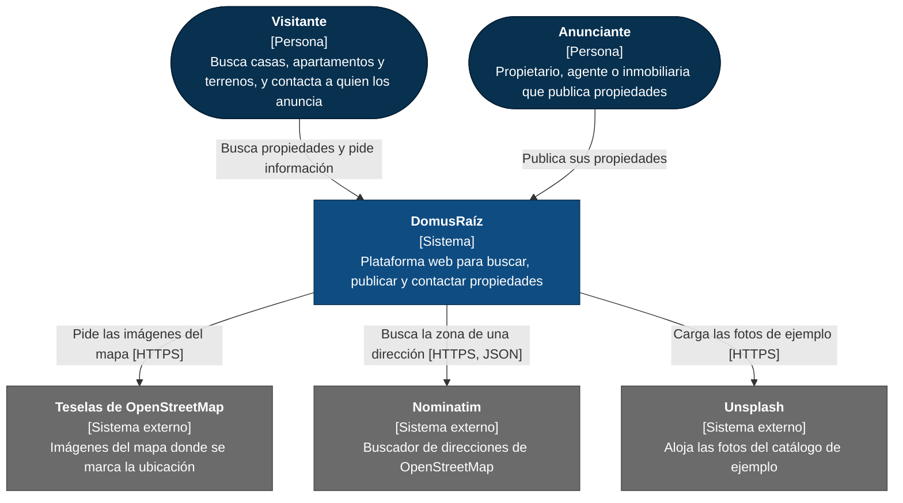
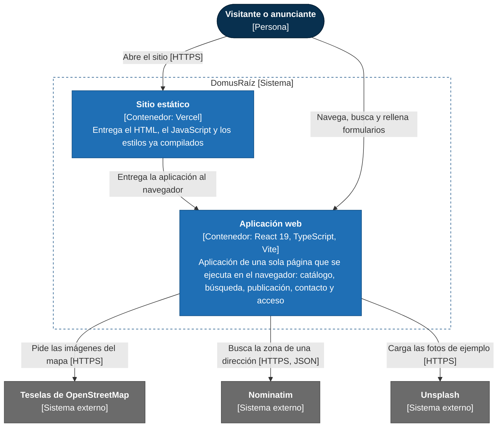
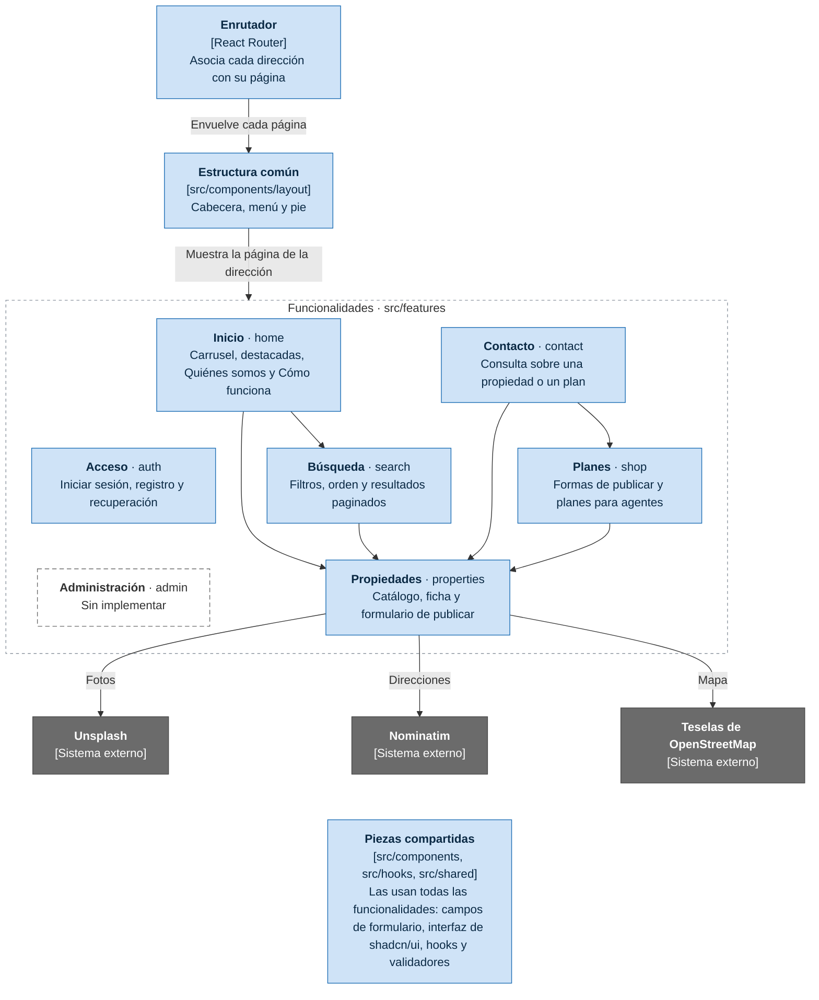
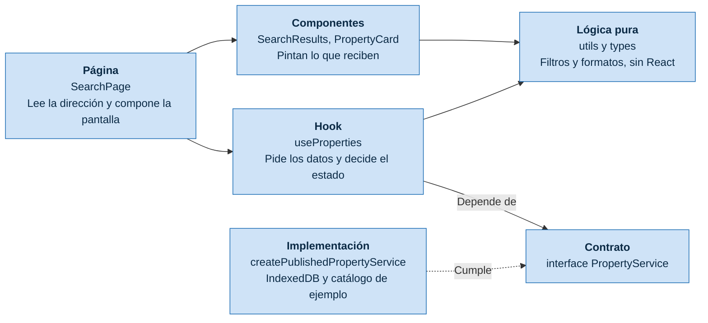
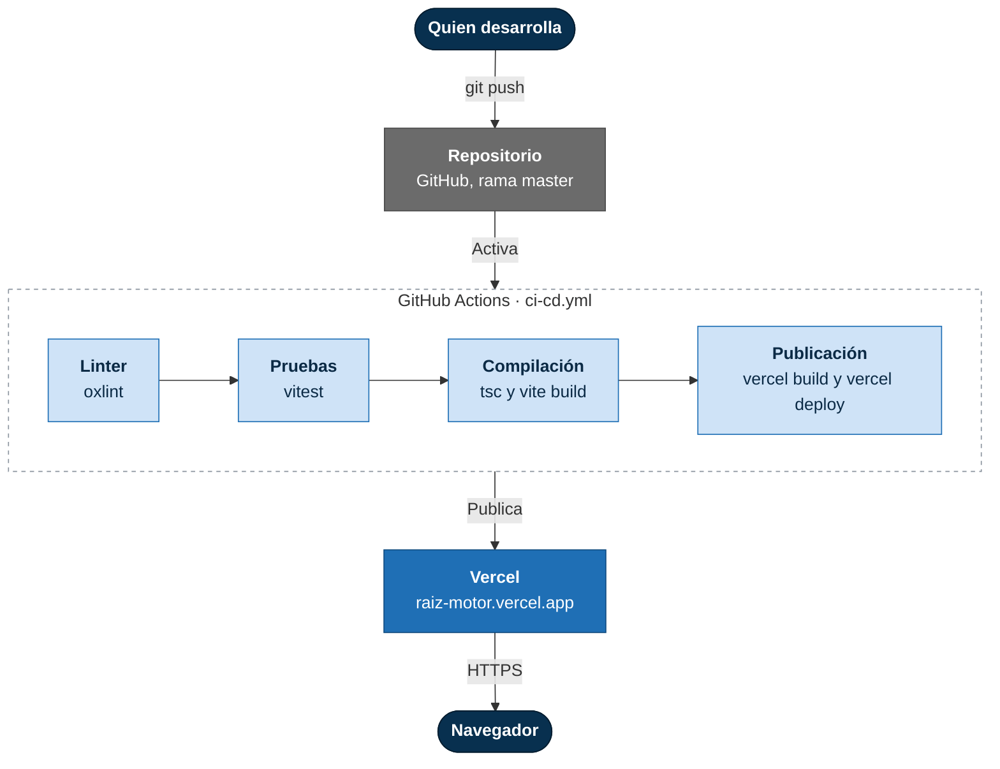

# Arquitectura de DomusRaíz

Este documento describe la arquitectura con el [modelo C4](https://c4model.com/): cuatro niveles que van de lo general a lo concreto, más las reglas de idempotencia y el despliegue. Refleja el código tal como está en `master`. Si cambias una funcionalidad o un servicio, actualiza el diagrama que lo muestra.

- [Nivel 1 · Contexto](#nivel-1--contexto): quién usa el sistema y de qué servicios externos depende.
- [Nivel 2 · Contenedores](#nivel-2--contenedores): qué piezas se despliegan.
- [Nivel 3 · Componentes](#nivel-3--componentes-de-la-aplicación-web): cómo se organiza la aplicación web por dentro.
- [Nivel 4 · Código](#nivel-4--código-las-capas-de-una-funcionalidad): las capas que sigue cada funcionalidad.
- [Idempotencia](#idempotencia): qué pasa cuando una acción se repite.
- [Despliegue](#despliegue): cómo llega un cambio al sitio publicado.

## Cómo leer los diagramas

Los diagramas son de Mermaid, que GitHub dibuja directamente. Usan diagramas de flujo con los colores del modelo C4, porque la notación C4 propia de Mermaid superpone textos y flechas.

```mermaid
flowchart LR
    persona(["Persona"]) ~~~ sistema["Sistema"] ~~~ contenedor["Contenedor"] ~~~ componente["Componente"] ~~~ externo["Sistema externo"] ~~~ pendiente["Sin implementar"]

    classDef persona fill:#08304f,stroke:#041d30,color:#fff
    classDef sistema fill:#0f4c81,stroke:#08304f,color:#fff
    classDef contenedor fill:#1f6fb5,stroke:#0f4c81,color:#fff
    classDef componente fill:#cfe3f7,stroke:#1f6fb5,color:#0b2a45
    classDef externo fill:#6b6b6b,stroke:#4a4a4a,color:#fff
    classDef pendiente fill:#fff,stroke:#6b6b6b,color:#333,stroke-dasharray:6 4
    class persona persona
    class sistema sistema
    class contenedor contenedor
    class componente componente
    class externo externo
    class pendiente pendiente
```

## Nivel 1 · Contexto

DomusRaíz es una plataforma web inmobiliaria para Honduras. La usan dos tipos de persona y, hoy, depende de tres servicios externos.

Al buscador de direcciones solo se le envían la colonia, la ciudad y el departamento; nunca la calle ni el número de la casa.

### Lo que todavía no está conectado

Todavía no hay servidor propio. Las publicaciones se guardan en IndexedDB del navegador y solo están disponibles en ese mismo origen y perfil; la página de publicar y la tarjeta del catálogo lo avisan a quien publica, y la ventana de compartir advierte de que el enlace no servirá a otras personas. El inicio de sesión y el envío de contacto siguen pendientes de conectar con servicios externos.

| Función | Qué falta | Dónde se conecta |
| --- | --- | --- |
| Iniciar sesión, registro y acceso con Google | Servicio de cuentas | Última línea de `src/features/auth/services/authService.ts` |
| Enviar el formulario de contacto | Servicio de correo | Última línea de `src/features/contact/services/contactService.ts` |
| Cotizar una propiedad | Servidor que reciba la solicitud; hoy se rechaza y la ficha avisa de que no se envió | Última línea de `src/features/properties/services/quoteService.ts` |
| Reportar una publicación | Servidor que reciba el reporte; hoy se rechaza y la ventana avisa de que no se envió | Última línea de `src/features/properties/services/reportService.ts` |
| Vistas de una ficha | Servidor que sume las de todos los visitantes; hoy se cuentan las de este navegador y la ficha lo dice | Última línea de `src/features/properties/services/propertyViewService.ts` |
| Catálogo compartido | Los anuncios locales se combinan con las propiedades de ejemplo | Última línea de `src/features/properties/services/propertyService.ts` |

## Nivel 2 · Contenedores

El sistema tiene dos contenedores: el sitio estático que entrega los archivos y la aplicación que se ejecuta en el navegador. El catálogo de ejemplo viaja dentro de la aplicación; las publicaciones y sus fotos quedan en IndexedDB del navegador.

Las rutas las resuelve la aplicación en el navegador, no el sitio estático. Por eso `vercel.json` le dice a Vercel que entregue `index.html` en cualquier dirección: al entrar por un enlace directo, como `/propiedades`, llega la aplicación y esta muestra la página correcta.

## Nivel 3 · Componentes de la aplicación web

La aplicación se organiza por funcionalidades. Cada carpeta de `src/features` reúne sus páginas, componentes, hooks, servicios, tipos y utilidades.

Una flecha entre dos funcionalidades significa que la primera usa piezas de la segunda:

- **Inicio** muestra el buscador de Búsqueda y las propiedades destacadas de Propiedades. Las fotos de su carrusel también vienen de Unsplash.
- **Búsqueda** lista el catálogo de Propiedades.
- **Contacto** lee de Propiedades y de Planes sobre qué propiedad o plan se consulta.
- **Planes** lee de Propiedades cuántas publicaciones incluye el plan gratuito: la tarjeta del plan promete las mismas que admite el formulario de publicar.

| Funcionalidad | Carpeta | Páginas | Servicios |
| --- | --- | --- | --- |
| Inicio | `src/features/home` | `/` (la compone `src/pages/HomePage.tsx`) | Ninguno propio |
| Búsqueda | `src/features/search` | `/propiedades`, `/propiedades/:tipo` | Usa `propertyService` |
| Propiedades | `src/features/properties` | `/propiedad/:id`, `/publicar` | `propertyService`, `publicationService`, `geocodingService`, `locationMap` |
| Contacto | `src/features/contact` | `/contacto` | `contactService` |
| Planes | `src/features/shop` | `/planes`, `/planes/agente-inmobiliario`, `/planes/agente-inmobiliario/contratar/:plan` | `planRequestService` |
| Acceso | `src/features/auth` | `/iniciar-sesion`, `/registro`, `/recuperar-contrasena` | `authService` |
| Administración | `src/features/admin` | Ninguna todavía | Ninguno |

La página de publicar se carga de forma diferida, para que la biblioteca del mapa (Leaflet) no pese en la portada.

### Servicios

Un servicio es la única puerta de una funcionalidad hacia el exterior. Cada uno declara un contrato (`interface`) y elige su implementación en una sola línea, al final del archivo. Los que escriben reciben además una [clave de operación](#la-clave-de-operación).

| Servicio | Qué hace hoy |
| --- | --- |
| `propertyService` | Combina el catálogo de ejemplo con los anuncios de IndexedDB y aplica filtros y paginación. Si el almacenamiento del navegador falla, sigue sirviendo el catálogo de ejemplo. |
| `geocodingService` | Consulta Nominatim, como mucho una vez por segundo, para situar una dirección, y recuerda las respuestas. |
| `locationMap` | Encapsula Leaflet: es el único archivo que conoce la biblioteca del mapa. |
| `publicationService` | Guarda cada anuncio y sus fotos en IndexedDB; devuelve su ID y mantiene la clave de operación para evitar duplicados. |
| `contactService` | Provisional: rechaza con `ContactUnavailableError`. |
| `authService` | Provisional: rechaza con `AuthUnavailableError` o `RegistrationUnavailableError`. |

## Nivel 4 · Código: las capas de una funcionalidad

Todas las funcionalidades siguen las mismas capas. El ejemplo es la búsqueda del catálogo.

- **El componente pinta y el hook decide.** Los componentes no piden datos ni conocen servicios.
- **El hook depende del contrato, no de la implementación.** Recibe el servicio como parámetro con un valor por defecto, y por eso las pruebas pueden pasarle uno falso.
- **La implementación se elige en un solo sitio.** `propertyService` combina el catálogo de ejemplo con `createPublishedPropertyService`; para conectar una API compartida se cambia esa línea.
- **La lógica pura vive en `utils`.** Validaciones, filtros y formatos se prueban sin React.

## Idempotencia

Repetir una acción deja el mismo resultado que hacerla una vez. Vale para quien usa el sitio (doble clic, reintento, recarga) y para quien lo desarrolla (volver a instalar, compilar o desplegar).

| Si se repite… | Qué pasa | Dónde está |
| --- | --- | --- |
| Un envío mientras el anterior sigue en curso | Sale una sola petición: el segundo se une al primero. | `src/hooks/useAttempt.ts` |
| Un envío que ya terminó bien, sin cambiar nada | No se envía otra vez, y el botón queda desactivado hasta que cambie algún dato. | `useAttempt`, `ContactForm`, `PropertyForm`, `PropertyQuoteForm`, `ReportPropertyForm` |
| Un envío que falló | El reintento lleva la misma clave de operación que el intento anterior. | `useAttempt`, `src/shared/utils/operationKey.ts` |
| La misma búsqueda del catálogo | No apila otra entrada en el historial: «atrás» sale de los resultados a la primera. | `useSearch` |
| La búsqueda de una misma dirección | No se vuelve a consultar Nominatim. Un fallo no se recuerda, para poder reintentar. | `geocodingService` |
| Una búsqueda de dirección antes de que termine otra | Cuenta la última pedida, aunque la anterior responda después. | `useAddressSearch` |
| La misma foto en un anuncio | Se rechaza como duplicada. | `imageFiles` |
| La solicitud de un plan por WhatsApp | Vuelve a abrir el chat con el mismo mensaje. El sitio no envía nada: la solicitud sale solo cuando la persona envía el mensaje, y la página se lo recuerda. | `planRequestService`, `useCheckoutForm` |
| La publicación gratuita | Reintentar el mismo envío devuelve el anuncio que ya se guardó. Un anuncio distinto se rechaza: el plan Propietario incluye una sola publicación. | `publicationService`, `publicationLimit` |
| La visita a una ficha (recarga, efecto repetido) | Cuenta una sola vista por visita: el total no sube hasta abrir la ficha en otra pestaña o sesión. | `propertyViewService` |
| El cierre del mapa | La segunda vez no hace nada. | `locationMap` |
| Una lectura del catálogo | Devuelve lo mismo y no cambia nada; las respuestas de peticiones anteriores se descartan. | `propertyService`, `useAsyncData` |
| La instalación, la compilación o el despliegue | `npm ci` instala exactamente lo que fija `package-lock.json`, dos compilaciones del mismo código producen los mismos archivos y relanzar el pipeline publica lo mismo. | `package-lock.json`, `.github/workflows/ci-cd.yml` |

### La clave de operación

Crear una cuenta, publicar una propiedad y enviar un mensaje son escrituras: repetidas sin control, dejarían dos cuentas, dos anuncios o dos mensajes. Por eso `register`, `publish` y `send` reciben, junto con los datos, una clave que identifica la operación:

- **Se mantiene al reintentar.** Si un envío falla, o no se sabe si llegó, el reintento lleva la misma clave.
- **Cambia cuando cambian los datos.** Editar el formulario lo convierte en otra operación, con otra clave.
- **Cada formulario tiene la suya.** Abrir de nuevo el formulario empieza una operación distinta.

La publicación guarda la clave en un índice único de IndexedDB. Si llega otra vez, devuelve el ID guardado sin crear otro anuncio. Por eso el límite de una publicación gratuita distingue por la clave: el reintento de un anuncio ya guardado pasa, y un anuncio nuevo se rechaza. Mientras no haya cuentas, el límite se cuenta por navegador. Las cuentas y el contacto siguen pendientes de sus servicios externos.

Iniciar sesión no lleva clave: repetirlo deja la misma sesión.

## Despliegue

Cada cambio en `master` pasa por el mismo pipeline, definido en `.github/workflows/ci-cd.yml`. Si un paso falla, el sitio publicado no cambia.

- **Solo publica el pipeline.** `vercel.json` desactiva el despliegue automático de Vercel, que publicaría cada push aunque las pruebas fallaran.
- **En un pull request** se ejecutan el linter, las pruebas y la compilación, pero no se publica.
- **Para publicar hacen falta tres secretos** en el repositorio: `VERCEL_TOKEN`, `VERCEL_ORG_ID` y `VERCEL_PROJECT_ID`. Si falta alguno, el despliegue falla y lo dice, en lugar de darlo por hecho; si alguno no corresponde al proyecto, el pipeline averigua cuál y lo avisa. El README dice de dónde sale cada uno.
- **El sitio se sirve en la raíz del dominio.** Si alguna vez se publicara bajo un prefijo, la compilación lo recibiría con `--base` y el enrutador lo tomaría de `import.meta.env.BASE_URL`.
- **Los enlaces directos** funcionan porque `vercel.json` entrega la aplicación en cualquier dirección.
